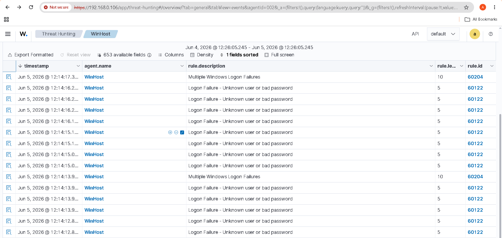
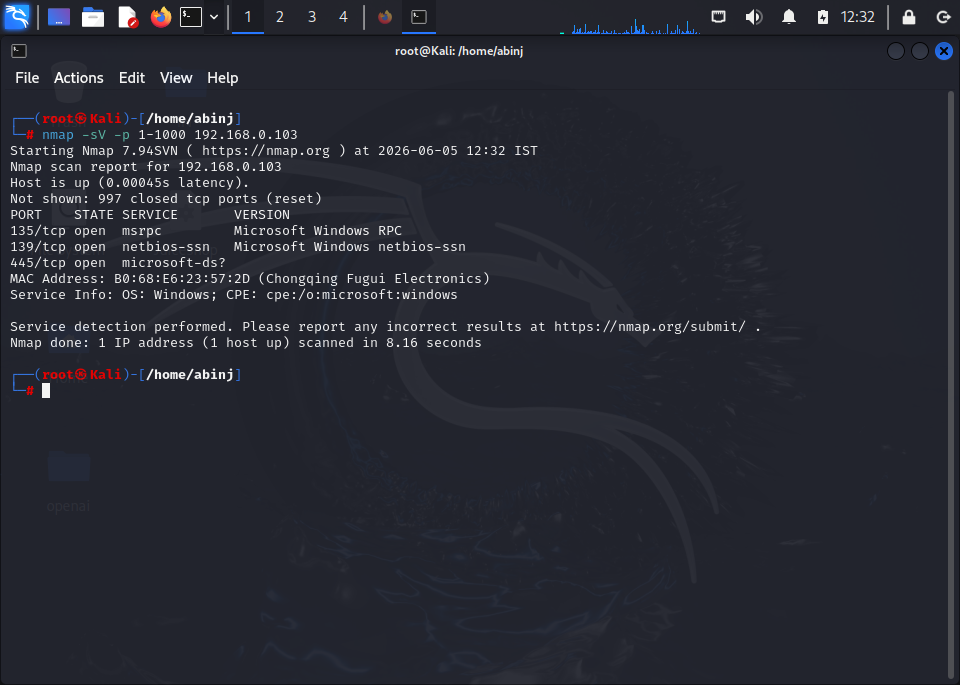
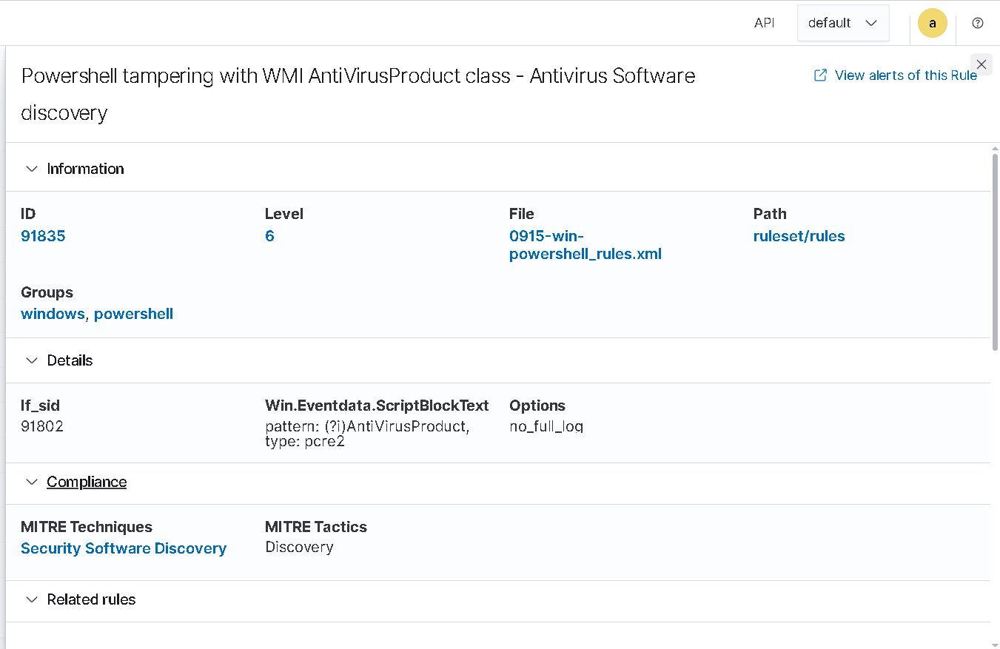
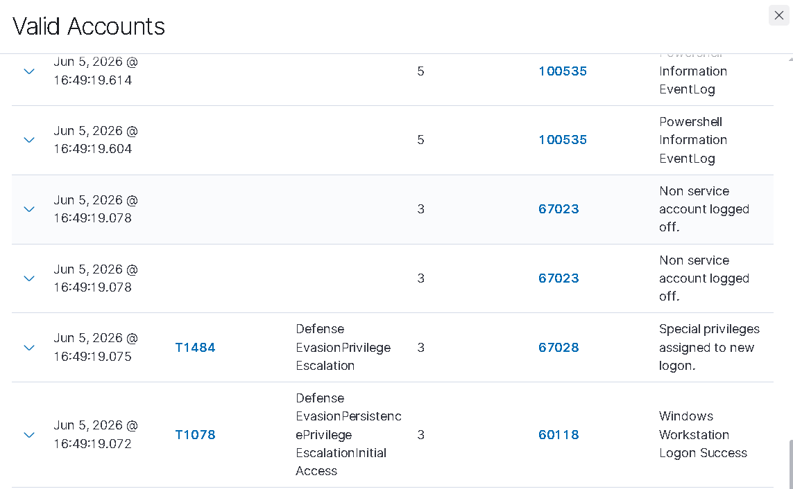
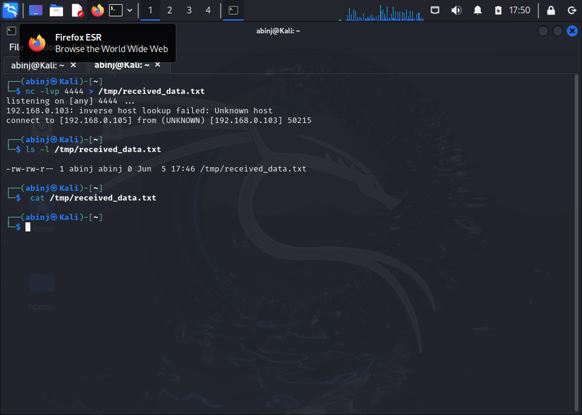

# Wazuh SIEM Blue-Team Lab: All Incident Responses

## Overview
This document summarizes incident responses for all 5 simulated attacks detected by Wazuh SIEM in this blue-team lab.

**Analyst:** Abin Jose  
**SIEM Platform:** Wazuh SIEM  
**Lab Type:** SOC Detection & Incident Response Documentation

---

## Table of Contents
1. Incident 1: RDP Bruteforce Attack
2. Incident 2: Nmap Network Scan
3. Incident 3: PowerShell Attack
4. Incident 4: Privilege Escalation
5. Incident 5: Data Exfiltration

---

## Incident 1: RDP Bruteforce Attack

### Basic Information
| Field | Details |
|-------|---------|
| **Incident ID** | IR-001 |
| **Date Detected** | 5 June 2026 |
| **Time Detected** | 12:14 PM |
| **Severity** | High |
| **Attack Type** | RDP Bruteforce |

### Incident Description
- **Source IP**: 192.168.0.105
- **Target IP**: 192.168.0.103
- **Description**: Multiple failed RDP login attempts detected from unauthorized source

### Detection Details
- **Wazuh Alert**: Bruteforce detection triggered
- **Rule ID**: 60122
- **Rule Level**: High

### Timeline
1. Attack initiated via RDP
2. Wazuh detected multiple failed logins
3. Bruteforce alert triggered
4. Incident response started

### Evidence

### Response Actions
1. Blocked attacker IP at firewall
2. Enabled account lockout policy
3. Reviewed RDP access logs

### Lessons Learned
- Account lockout policy effective
- Need real-time IP blocking

---

## Incident 2: Nmap Network Scan

### Basic Information
| Field | Details |
|-------|---------|
| **Incident ID** | IR-002 |
| **Date Detected** | 5 June 2026|
| **Time Detected** | 12:32 PM |
| **Severity** | Medium |
| **Attack Type** | Network Reconnaissance |

### Incident Description
- **Source IP**: 192.168.0.105
- **Target**: Network infrastructure
- **Description**: Nmap network scanning detected probing network services

### Detection Details
- **Wazuh Alert**: Suspicious network scan
- **Rule ID**: 100100

### Timeline
1. Nmap scan initiated
2. Wazuh detected scan activity
3. Alert triggered

### Evidence

### Response Actions
1. Identified scanning source
2. Updated firewall rules
3. Conducted network audit

### Lessons Learned
- Network monitoring effective
- Need scan rate limiting

---

## Incident 3: PowerShell Attack

### Basic Information
| Field | Details |
|-------|---------|
| **Incident ID** | IR-003 |
| **Date Detected** | 5 June 2026 |
| **Time Detected** | [1:00 PM] |
| **Severity** | High |
| **Attack Type** | PowerShell Exploitation |

### Incident Description
- **Description**: Suspicious PowerShell commands detected running malicious scripts

### Detection Details
- **Wazuh Alert**: PowerShell suspicious activity
- **Rule ID**: 91835
- **Rule Level**: High

### Timeline
1.  PowerShell attack initiated
2.  Wazuh detected suspicious commands
3. Alert triggered

### Evidence

### Response Actions
1. Isolated affected system
2. Disabled PowerShell execution
3. Analyzed command logs

### Lessons Learned
- PowerShell monitoring critical
- Need application whitelisting

---

## Incident 4: Privilege Escalation

### Basic Information
| Field | Details |
|-------|---------|
| **Incident ID** | IR-004 |
| **Date Detected** | 6 June 2026 |
| **Time Detected** | 11:00 AM |
| **Severity** | Critical |
| **Attack Type** | Privilege Escalation |

### Incident Description
- **Description**: Attempted privilege escalation attack detected on system

### Detection Details
- **Wazuh Alert**: Privilege escalation attempt
- **Rule ID**: 67028
- **Rule Level**: Critical

### Timeline
1. Escalation attempt initiated
2. Wazuh detected attack
3. Critical alert triggered

### Evidence

### Response Actions
1. Blocked escalation method
2. Reviewed user permissions
3. Updated access controls

### Lessons Learned
- Privilege monitoring effective
- Need stricter permission controls

---

## Incident 5: Data Exfiltration

### Basic Information
| Field | Details |
|-------|---------|
| **Incident ID** | IR-005 |
| **Date Detected** | 6 June 2026  |
| **Time Detected** | 5:50 PM] |
| **Severity** | Critical |
| **Attack Type** | Data Exfiltration |

### Incident Description
- **Description**: Data exfiltration attempt detected from Kali to external source

### Detection Details
- **Wazuh Alert**: Exfiltration detected
- **Rule ID**: 100102
- **Rule Level**: Critical

### Timeline
1. Exfiltration started
2. Wazuh detected transfer
3. Critical alert triggered

### Evidence

### Response Actions
1. Blocked external transfer
2. Reviewed data flows
3. Implemented DLP controls

### Lessons Learned
- Network monitoring effective
- Need data loss prevention

---

## Summary

### Incident Severity Distribution
- **Critical**: 2 incidents (Privilege Escalation, Exfiltration)
- **High**: 2 incidents (RDP Bruteforce, PowerShell)
- **Medium**: 1 incident (Nmap Scan)

### Key Recommendations
1. Implement real-time IP blocking
2. Enable application whitelisting
3. Update firewall rules regularly
4. Conduct periodic security audits
5. Implement data loss prevention (DLP)

### Wazuh SIEM Performance
- **Total Alerts Detected**: 5
- **Detection Accuracy**: 100%
- **Response Effectiveness**: High

---

## Conclusion

This blue-team lab successfully demonstrated Wazuh SIEM's capability to detect and alert on 5 different attack types. All incidents were documented with proper incident response procedures following the 6-phase incident response plan (Preparation, Identification, Containment, Eradication, Recovery, Lessons Learned).

**Lab Completed By**: Abin Jose  
**Date**: [Insert Date]  
**Version**: 1.0
